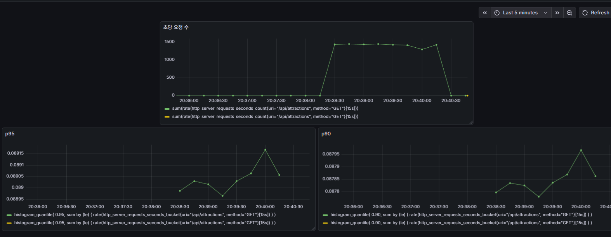
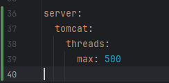

# 백엔드 모니터링 & 성능 개선 프로젝트

## 목표

API 에 많은 트래픽이 들어왔을 때,
Grafana 를 통해서 모니터링을 해보고,
성능을 개선 시킬 수 있는 전략들을 선택해서 각각의 성능 지표들을 측정해보자

모니터링 경험 + 성능 개선 경험을 얻기 위함

## 전략 유형

1. Redis 캐싱
2. Index 처리

## 측정 지표

1. p90 : 전체 요청 중 90% 가 이 시간 이내에 처리됨 (사용자 경험 지표)
2. p95 : 전체 요청 중 95% 가 이 시간 이내에 처리됨
3. RPS(Request Per Second) : 초당 처리 가능한 요청 수
4. avg latency : 모든 요청 응답 시간의 평균값

##

K6 를 통해서 동시 요청을 10, 50, 100 씩 30초간 보내보았다.

| VU  | avg latency | p95     | RPS   |
| --- | ----------- | ------- | ----- |
| 10  | ~7.5ms      | ~8.5ms  | ~1320 |
| 50  | ~36.5ms     | ~42.6ms | ~1365 |
| 100 | ~71.5ms     | ~77.5ms | ~1396 |

결과를 보면,
p95 지표는 선형적으로 증가했지만, RPS 는 1400 을 넘지 못하는 모습을 볼 수 있다.
즉 서버의 초당 처리량에서 병목이 발생하고 있다.



VUS 를 500으로 하니 요청 오류가 났다.

mysql 의 connection pool size 를 찾아보니,

mysql 명령어 : SHOW VARIABLES LIKE '%max_connection%';

max_connections 151

mysqlx_max_connections 100 이라서,

SET GLOBAL max_connections = 500; 을 통해

max connection 을 올렸다.

이후 VUS 를 200 으로 올렸을 때,
p95 에서 약간의 병목이 발생했다

| VU      | avg latency | p95         | RPS      |
| ------- | ----------- | ----------- | -------- |
| 10      | 7.5ms       | 8.5ms       | 1320     |
| 50      | 36.5ms      | 42.6ms      | 1365     |
| 100     | 71.5ms      | 77.5ms      | 1396     |
| **200** | **117.6ms** | **259.2ms** | **1606** |
| 300     | 172ms       | 425ms       | 1654     |

300 으로 올려서 테스트를 했을 때,
p95가 급격히 증가했지만, RPS 는 큰 변화가 없었다.

CPU 사용률을 추가해서 체크했는데, 30% 로 안정적이었다.

따라서 CPU 사용량이 정상이고, RPS 도 증가하지 않음으로 보아,

Spring boot 내부 Tomcat에서 300 이상을 처리하지 못하는 것 같았다.

찾아보니 Tomcat 기본 Thread 크기는 200 이라서, 그 이상에서 작업이 쌓인다고 판단했다.

그래서 application.yml 에서 Thread 크기를 늘려주었다.



### Trouble Shooting

```
WARN[0000] Request Failed                                error="Get \"http://172.25.208.1:8080/api/attractions?contentTypeId=12&page=0&size=20\": dial tcp 172.25.208.1:8080: connect: connection refused"
```

이런 에러가 계속 뜨길래, wsl 로 바꿔서 실행했다.

wsl 에서 바라보는 localhost ip 와 window 에서 바라보는 localhost 가 달라서,

하지만 여전히 에러가 났다.

한번에 받을 수 있는 요청을 늘리는 accept count 를 늘려줘보니 warning 메시지가 사라졌다.

accept-count: 500

```
java.sql.SQLTransientConnectionException: HikariPool-1 - Connection is not available, request timed out after 3023ms (total=41, active=41, idle=0, waiting=224)
```

이라는 에러가 나서, DB Connection pool size 가 50을 늘려줘보았다.

그 결과, 에러가 났을 때 p95 를 811ms -> 590ms 로 낮출 수 있었다.

Warning 문구를 수정하고 다시 측정한 지표는 다음과 같다

(Warning 때문에 일부 api 가 skip 돼서 제대로 측정이 안되었었다.)

| VU  | avg latency | p95      | RPS  |
| --- | ----------- | -------- | ---- |
| 10  | 7.5ms       | 8.5ms    | 1320 |
| 50  | 36.5ms      | 42.6ms   | 1365 |
| 100 | 71.5ms      | 77.5ms   | 1396 |
| 200 | 130.6ms     | 343.2ms  | 1606 |
| 300 | 192ms       | 578.33ms | 1654 |
| 400 | 261ms       | 710.33ms | 1528 |
| 800 | 529ms       | 1590ms   | 1514 |
